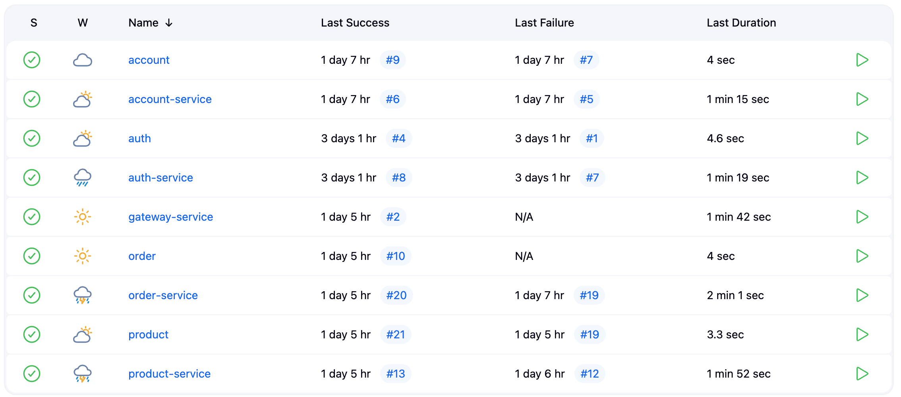
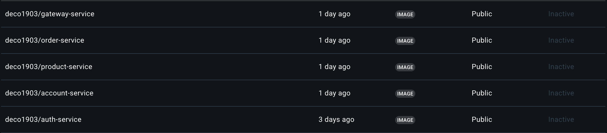

The Jenkins is a continuous integration and continuous deployment (CI/CD) tool that automates the process of building, testing, and deploying applications. It is widely used in software development to ensure that code changes are integrated smoothly and deployed efficiently.

## Jenkins CI/CD Pipeline
The Jenkins CI/CD pipeline for this project automates the build, test, and deployment processes. It is configured to trigger on code changes, ensuring that the latest version of the application is always tested and deployed.

- The pipeline is defined in a `Jenkinsfile`, which specifies the stages and steps involved in the CI/CD process. Example:

**Package's** `Jenkinsfile` in the root directory:
```groovy
pipeline {
    agent any

    stages {
        stage('Build') {
            steps {
                sh 'mvn -B -DskipTests clean install'
            }
        }
    }

}
```

**Service** `Jenkinsfile` in the root directory project:
```groovy
pipeline {
    agent any
    environment {
        SERVICE = 'order-service'
        NAME = "deco1903/${env.SERVICE}"
    }
    stages {
        stage('Dependecies') {
            steps {
                build job: 'order', wait: true
            }
        }
        stage('Build') { 
            steps {
                sh 'mvn -B -DskipTests clean package'
            }
        }      
        stage('Build & Push Image') {
            steps {
                withCredentials([usernamePassword(credentialsId: 'dockerhub-credential', usernameVariable: 'USERNAME', passwordVariable: 'TOKEN')]) {
                    sh "docker login -u $USERNAME -p $TOKEN"
                    sh "docker buildx create --use --platform=linux/arm64,linux/amd64 --node multi-platform-builder-${env.SERVICE} --name multi-platform-builder-${env.SERVICE}"
                    sh "docker buildx build --platform=linux/arm64,linux/amd64 --push --tag ${env.NAME}:latest --tag ${env.NAME}:${env.BUILD_ID} -f Dockerfile ."
                    sh "docker buildx rm --force multi-platform-builder-${env.SERVICE}"
                }
            }
        }
    }
}
```

- After the pipeline is defined, it is pushed to the repository. Jenkins automatically detects the `Jenkinsfile` and starts the CI/CD process.


- The pipeline consists of several stages, including building the application, running tests, and deploying the application to the docker hub.


