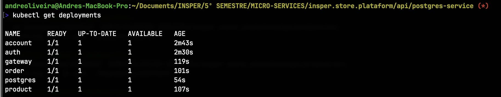

The Minikube was created to provide a local Kubernetes environment for testing and development purposes. It allows developers to run Kubernetes clusters on their local machines, making it easier to test applications in a Kubernetes environment without needing a full cloud setup.

Each service used the following k8s.yaml file to deploy the service in Minikube after the build and push to the Docker Hub.:
```yaml
apiVersion: apps/v1
kind: Deployment
metadata:
  name: order
spec:
  replicas: 1
  selector:
    matchLabels:
      app: order
  template:
    metadata:
      labels:
        app: order
    spec:
      containers:
        - name: order
          image: deco1903/order-service:latest
          imagePullPolicy: Always
          ports:
            - containerPort: 8080
          env:
            - name: DATABASE_HOST
              valueFrom:
                configMapKeyRef:
                  name: postgres-configmap
                  key: POSTGRES_HOST

            - name: DATABASE_USER
              valueFrom:
                secretKeyRef:
                  name: postgres-secrets
                  key: POSTGRES_USER

            - name: DATABASE_PASSWORD
              valueFrom:
                secretKeyRef:
                  name: postgres-secrets
                  key: POSTGRES_PASSWORD

---
apiVersion: v1
kind: Service
metadata:
  name: order
  labels:
    app: order
spec:
  type: ClusterIP
  ports:
    - port: 8080
  selector:
    app: order
```

For the gateway service, the k8s.yaml file is slightly different:
```yaml
apiVersion: apps/v1
kind: Deployment
metadata:
  name: gateway
spec:
  replicas: 1
  selector:
    matchLabels:
      app: gateway
  template:
    metadata:
      labels:
        app: gateway
    spec:
      containers:
        - name: db
          image: deco1903/gateway-service:latest
          imagePullPolicy: Always
          ports:
            - containerPort: 8080
          resources:
            requests:
              memory: "200Mi"
              cpu: "50m"
            limits:
              memory: "300Mi"
              cpu: "200m"

---

apiVersion: v1
kind: Service
metadata:
  name: gateway
  labels:
    app: gateway
spec:
  type: LoadBalancer
  ports:
    - port: 80
      protocol: TCP
      targetPort: 8080

  selector:
    app: gateway
```

- After applying the k8s.yaml files:


- And to connect with the Minikube cluster, you can use the following command to port-forward the gateway service to your local machine:
```bash
kubectl port-forward svc/gateway 8080:80
```


